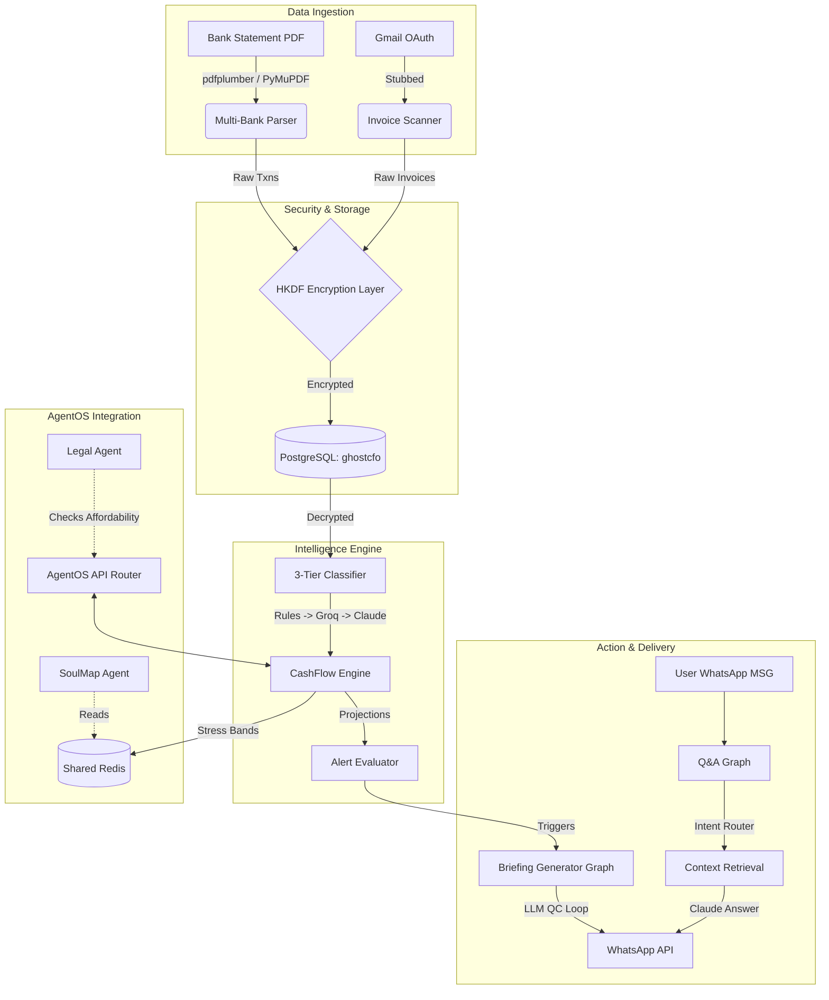

# GhostCFO Architecture

## System Diagram

## The 3-Tier Classification Matrix
To keep costs low while maintaining accuracy, GhostCFO uses a waterfall approach:
1. **Tier 1 (Regex Rules):** 80+ patterns covering UPI, IMPS, NEFT, and common Indian vendors (Swiggy, Amazon, AWS). Processes ~60% of volume at 0 cost and 0 latency.
2. **Tier 2 (Groq Batch LLM):** For unmatched transactions, an open-source 120B model processes batches of 20. High speed, very low cost.
3. **Tier 3 (Claude Opus):** For highly ambiguous single transactions or scanned images.

## The Encryption Layer
GhostCFO never stores sensitive financial data in plaintext.
- **Algorithm:** AES-128 via `cryptography.fernet`.
- **Key Derivation:** HKDF using SHA-256. A master key is held in memory, and a unique key is derived on the fly for each `user_id`.
- **Impact:** A database dump is useless without the master key. Even if one user's derived key is compromised, other users remain secure.
